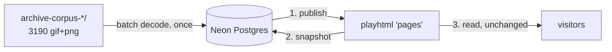

# Design Document: Archive Database & Publication Management

## Overview

Today the app has exactly one place where data lives: the playhtml (Yjs)
document named `teletext-house`, hosted on PartyKit. That document holds the
`pages` and `titles` channels plus every room's coordination state. It works
well for what it is good at — cell-level concurrent editing — and this design
does **not** replace it.

What it cannot do is be a library. There are 3,190 decoded archive captures
covering 832 distinct original page numbers, and only ~600 page slots
(100..699) to show them in. There is nowhere to keep the other 2,500+, nowhere
to record *why* a given capture was chosen for a given slot, no backup of the
live document, and no server-side identity to gate any of it.

This feature adds a Postgres database (Neon, via the Vercel Marketplace) as the
**system of record**, and keeps playhtml as the **live layer**.

### Correcting a premise

A Vercel redeploy does not clear playhtml state. The Yjs document is keyed by
the room name in `GlobalProvider.tsx` and persisted on PartyKit, entirely
independent of the deployment. Pages survive deploys today.

What does destroy pages on redeploy is `src/collab/seedPages.ts`:

```ts
const forceOverwrite = currentVersion < SEED_VERSION;
```

Raising `SEED_VERSION` and deploying overwrites every seed page and title
unconditionally, discarding collaborative edits by design — the file says so.
That path is removed by this feature; publishing from the database replaces it.

The genuine gaps a database closes are ownership (the current store is a
third-party free backend with no export), capacity (2,500+ unshown captures),
provenance (which capture is published where, and why), and authentication
(`VITE_MODERATOR_PASSCODE` is compiled into the client bundle and readable by
any visitor).

## Architecture

### Two layers

| | Database (Neon Postgres) | playhtml (Yjs / PartyKit) |
|---|---|---|
| Holds | full corpus, publication map, glyph atlas, snapshots | currently-published pages, titles, rooms |
| Written by | admin, batch import, snapshot job | every visitor, live |
| Read by | admin UI, publish job | every visitor, live |
| Conflict model | single writer, transactional | CRDT, per-cell merge |

Three flows connect them:



1. **Publish** (DB → playhtml). The admin assigns an `archive_capture` to a page
   number with a title and description; the server writes those cells into the
   `pages` channel. The write shape already exists —
   `useImportPages.importPages` replaces whole pages in one transaction.
2. **Snapshot** (playhtml → DB). A scheduled job and an admin button read the
   `pages` and `titles` channels and store them in `live_pages`. This is the
   backup, and the reason edits stop being disposable.
3. **Read** (unchanged). Viewers read playhtml exactly as they do now. No read
   path changes, so co-watching, voting, chat, and presence are untouched.

### Why playhtml stays

Redis stored a page as a value, so two simultaneous edits meant one client's
whole-page write landed on top of the other's — the observed failure. playhtml
is Yjs underneath and `PagesData` is deliberately keyed by cell index
(`src/collab/types.ts`), so edits to different cells merge and edits to the same
cell converge last-writer-wins. Moving live editing to Postgres would reintroduce
exactly the bug that motivated the move away from Redis. The database is never
in the live edit path.

### Direction of authority

`live_pages` is a *snapshot*, not a source. On conflict, playhtml wins for
published pages — it holds edits made since the last publish. The database is
authoritative only for the corpus, the publication map, and restore-from-backup.

## Data model

### Sizing

Measured on 62 real decoded RTP pages, not estimated:

| | Per page | Full 1,913-page RTP corpus |
|---|---|---|
| Raw JSON | 59.3 KB | 116 MB |
| gzipped | 1.3 KB | 2.6 MB |

Real teletext compresses **44x** — far better than the synthetic worst case
first used to size this (3.5 KB/page), because actual pages are long runs of
repeated cells rather than random content.

Store the **array** (`Cell[]`) form rather than playhtml's index-keyed map: on
the same content the array gzips ~40% smaller, and the map shape exists only to
make CRDT merges work per-cell, which is not something an archive needs.

Cells are `jsonb`, left to Postgres TOAST compression. Even at TOAST's weaker
ratio the corpus lands around 15–25 MB against Neon's 0.5 GB free tier, so the
`bytea`-of-gzip fallback is not needed and `jsonb` keeps the rows inspectable.

### Schema

```sql
-- One row per decoded capture. Written once by the batch import.
--
-- A page number is NOT a version key. Broadcasters reused numbers for entirely
-- different content across the years, so the ~4 captures averaging out per
-- number are usually unrelated pages, not revisions of one. Selection is
-- therefore a curatorial act, and every field that helps make it — topic,
-- scheme, capture dates — is kept and indexed rather than collapsed.
create table archive_captures (
  id             bigserial primary key,
  source         text    not null check (source in ('rtp','sic')),
  original_page  integer not null,            -- page number in the broadcast
  sub            text    not null,            -- subpage, e.g. '01'
  digest         text    not null,            -- Arquivo.pt content digest
  source_url     text,
  source_file    text    not null,            -- path within archive-corpus-*

  -- Selection metadata (see "Topics drive selection" below).
  topic          text,                        -- 'noticias', 'eventos/expo-98', ...
  topic_group    text,                        -- 'eventos' for 'eventos/expo-98', else = topic
  topic_decided_by text,                      -- 'header' | 'page-band' | 'banner' | 'event-window'
  scheme         text,                        -- era: '1998-2000' | '2001-2005' | '2006-2010'
  first_seen     timestamptz,                 -- earliest manifest timestamp
  last_seen      timestamptz,                 -- latest manifest timestamp
  capture_count  integer not null default 1,  -- how many days it was captured

  -- Source-specific; the two manifests do not agree on these.
  tier           text,                        -- RTP only: 'gif1'|'gif2'|'gif3' resolution
  bucket         text,                        -- SIC only: page band '100'..'800'

  manifest_title text,                        -- RTP only; SIC manifests have none
  profile        text    not null,            -- RenderProfile name from the decode
  width          integer not null,
  height         integer not null,
  cells          jsonb   not null,            -- TeletextPage: Cell[960]
  dropped_row    text    not null,            -- 'first' | 'last'
  dropped_had_content boolean not null,
  snapped_pixels integer not null,            -- >0 means a suspect decode
  unknown_glyphs integer not null,            -- unrecognised stencil count
  imported_at    timestamptz not null default now(),
  unique (source, digest)
);

create index on archive_captures (source, original_page, sub);
create index on archive_captures (topic);
create index on archive_captures (topic_group);
create index on archive_captures (scheme);
-- Partial index for the admin's default view: clean decodes only.
create index on archive_captures (source, original_page)
  where snapped_pixels = 0 and unknown_glyphs = 0;

-- What is live, and where. At most ~600 rows (page range 100..699).
create table published_pages (
  page_number  integer primary key
                 check (page_number between 100 and 699),
  capture_id   bigint  not null references archive_captures(id),
  title        text    not null default '',   -- <= 60 chars, matches domain/titles.ts
  description  text    not null default '',
  published_at timestamptz not null default now(),
  published_by text
);

-- Backup of the live playhtml document. Overwritten by the snapshot job.
create table live_pages (
  page_number integer primary key,            -- full 1..999, playground included
  cells       jsonb   not null,
  title       text    not null default '',
  updated_at  timestamptz not null default now()
);

-- Characters taught on the import screen, currently stranded in one browser's
-- localStorage under 'teletext.import.learnedGlyphs'.
create table learned_glyphs (
  glyph_key  text primary key check (glyph_key ~ '^[0-9a-f]{16,80}$'),
  character  text not null check (length(character) > 0),
  taught_at  timestamptz not null default now()
);
```

Note the page range: `published_pages` is constrained to 100..699 because
`src/domain/access.ts` reserves 700..999 as the open playground. Playground
pages are never published from the archive, but they *are* snapshotted into
`live_pages` — they are the visitors' own work and are exactly what most needs
backing up.

### Manifest field differences

The two corpora do not share a schema, and the import must normalise them:

| Field | RTP | SIC |
|---|---|---|
| `tier` | `gif1`/`gif2`/`gif3` — **render resolution** | absent |
| `bucket` | absent | `100`..`800` — **page hundred-band** |
| `superseded[]` | present | absent |
| `title` | present | absent |
| `scheme` | `1998-2000`, `2001-2005` | `2006-2010` |

`tier` and `bucket` occupy the same slot in the two files but mean unrelated
things — one is image resolution, the other is a page-number band. They are
stored as separate nullable columns rather than merged into a single field.
`bucket` is derivable from `original_page` and kept only for fidelity.

Both carry `page`, `sub`, `digest`, `url`, `timestamps`, `file`, `topic`,
`scheme`, `width`, `height`, `native`, `source_file`, `decided_by`. The
`superseded` array is dropped: it records copies deliberately not kept.

**`timestamps` is an array, not a scalar** — up to 9 entries, one per capture
day. A page captured on nine separate days was on air far longer than one
captured once, which is a useful signal when choosing between candidates, so the
import records `first_seen`, `last_seen`, and `capture_count` rather than
keeping only the first timestamp.

### Topics drive selection

Selection happens by topic, not by page number: the corpus is already divided
into the folders `noticias`, `desporto`, `televisao`, `cultura`, `economia`,
`meteorologia`, `utilidades`, `publicidade`, `servicos-sms`, `indice`,
`passatempos`, `jogos-sorte`, `diario-republica`, `classificados`, and the
nested `eventos/*` (`expo-98`, `meia-maratona`, `porto-2001-capital-cultura`,
`agenda-sic`, `mundial-2006`).

Nested topics are preserved whole in `topic` and *also* split into
`topic_group` (`eventos`) so the admin UI can offer both "all events" and one
specific event. `topic_decided_by` records how the classification was reached
(`header`, `page-band`, `banner`, `event-window`) so a topic inferred from a
page band can be trusted less than one read off the page header.

## What the corpus actually contains

Established by running the decoder over every capture (`--dry-run`), not
assumed. Three things differed from what the manifests claim:

| | RTP | SIC |
|---|---|---|
| Captures catalogued | 1,913 | 1,235 |
| Decoded to cells | **1,913** | **1,235** |
| Render sizes | 520x400, 400x300, 320x250 | 320x240, 480x336 |
| Rows per render | 25 | 24 |

All 3,148 decode. 223 cells out of 3.04 million — **0.007%** — still hold an
unrecognised stencil, across 44 rare glyphs that the import screen can be taught
and which now persist to the shared atlas.

| Profile | Pages | Pages with any unknown | Unknown cells |
|---|---|---|---|
| 520x400 (RTP) | 627 | 0 | 0 |
| 400x300 (RTP) | 750 | 5 | 32 |
| 320x250 (RTP) | 538 | 0 | 0 |
| 320x240 (SIC) | 1,170 | 67 | 130 |
| 480x336 (SIC) | 85 | 19 | 61 |

### What SIC needed

SIC was undecodable for two reasons, both of them assumptions baked into the
decoder rather than anything wrong with the corpus:

1. **Row count was a global constant.** `SOURCE_ROWS = ROWS + 1` asserted 25
   rows for every render size, so a 24-row SIC image did not match any profile
   and was rejected outright. It is now `RenderProfile.sourceRows`, and
   `droppedRow` is `null` when nothing needs dropping.
2. **The font is per profile, not per cell size.** SIC's 320x240 uses the same
   8x10 cells as RTP's 320x250 and shares not one stencil with it — SIC draws
   two-pixel stems where RTP draws one. Two new atlases were built from the
   corpus (114 glyphs at 8x10, 103 at 12x14) by pooling unplaced stencils across
   all captures, drawing them as ASCII, and reading the characters off.

Three things made that harder than a straight transcription, each worth knowing
before touching it again:

- **Double-height halves masquerade as characters.** With an empty atlas,
  double-height detection cannot work — it needs the atlas to confirm the
  reconstruction — so both halves of every tall character surface as unknown
  stencils. Transcribing them would file half a glyph under a letter. They are
  filtered on the first pass and the filter is removed on the second, once the
  base characters resolve them.
- **Bar-built letters look row-doubled.** `E`, `T`, `I`, `L`, `F`, `H` are drawn
  from two-pixel bars, so their rows come in identical pairs by coincidence and
  the double-height filter ate them. They are genuine single-height stencils.
- **The 12x14 sixel geometry had to be measured.** The three bands are 4/6/4
  pixel rows, not the even split the cell height suggests; guessing it made
  block graphics decode as unknown characters.

### One place the decoder cannot be exact

SIC's fonts draw capital `O` and digit `0` with **identical pixels** — verified,
not assumed: the `O` in `MUNDO` and the `0` in `220` on the same rendered line
produce the same stencil key. (RTP's fonts distinguish them, which is why this
never came up before.)

No inspection of a single cell can separate those, so `resolveHomoglyphs`
settles it from the run of text the cell sits in: the first unambiguous
character in a word decides whether its ambiguous cells are digits or letters.
`220` and `2O1` resolve on their leading `2`, `MUNDO` and `NOTÍCIAS` on their
`M` and `N`. It is the only heuristic in the module and is confined to one
function, declared per profile via `homoglyphDigits`.

The rendered page is identical either way — the same stencil was drawn — so this
only affects the stored text.

### The folders are the topic division, not the manifest

The RTP manifest's `topic` field is stale. 236 captures are filed on disk under
a different folder than it records, and 70 of those sit in a `horoscopo` folder
that appears nowhere in the manifest's topic list — that division was made by
hand, after the manifest was generated.

So the importer locates each image **by filename** rather than by the manifest's
recorded path, and takes the topic from the folder it is found in.
`topic_source` records whether a row's topic came from the folder or the
manifest. This both fixes the classification and recovers the captures: before
it, 248 RTP images appeared to be missing; after it, 0 fail and only 13 are
genuinely absent from disk. SIC's manifest and folders agree exactly.

## Decoding the corpus outside the browser

`src/utils/archiveImage.ts` is canvas-based and browser-only, but
`importArchiveImage(pixels, extraGlyphs)` in `src/domain/archiveImport.ts` is
pure and takes a structural `SourcePixels` (`{ width, height, data }`). The
batch import therefore reuses the decoder unchanged and only needs a Node-side
pixel source.

`sharp` is the right tool: it decodes both GIF and PNG via libvips and returns
raw RGBA. It is added as a **devDependency** — the batch script is a local
operation, never part of the deployed bundle.

Fidelity is the constraint that matters. `archiveImport` requires every pixel to
be exactly a palette colour and reports `snappedPixels` when they are not, so
the Node loader must not resize, must not colour-manage, and must not
premultiply:

```ts
sharp(path).raw().ensureAlpha().toColourspace('srgb')
```

with no `.resize()` in the chain. A non-zero `snappedPixels` on a capture is
recorded rather than silently accepted, so a bad decode is visible in the admin
UI instead of becoming a corrupt archive row.

## API surface

Vercel serverless functions under `api/`. All mutating routes require the admin
cookie; the two read routes used by the public app do not.

| Route | Method | Auth | Purpose |
|---|---|---|---|
| `/api/auth/login` | POST | — | password → set cookie |
| `/api/auth/logout` | POST | admin | clear cookie |
| `/api/auth/me` | GET | — | is this session admin? |
| `/api/captures` | GET | admin | browse corpus (filter by source/topic/page, paginated) |
| `/api/captures/[id]` | GET | admin | one capture with cells, for preview |
| `/api/published` | GET | — | the publication map (page → title, description) |
| `/api/published` | PUT | admin | assign capture + title + description to a page number |
| `/api/published/[page]` | DELETE | admin | unpublish |
| `/api/snapshot` | POST | admin/cron | store current playhtml state in `live_pages` |
| `/api/glyphs` | GET/POST | GET public, POST admin | shared learned-glyph atlas |

### Blocking gotcha: the catch-all rewrite

`vercel.json` currently rewrites everything to the SPA:

```json
{ "source": "/(.*)", "destination": "/index.html" }
```

This swallows every API route. It must become:

```json
{ "source": "/((?!api/).*)", "destination": "/index.html" }
```

Nothing in this feature works until that changes.

## Authentication

One admin, one password. No auth provider — for a single operator it would be
more moving parts than the thing it protects.

- Password lives in `ADMIN_PASSWORD`, deliberately **not** `VITE_`-prefixed so
  Vite cannot inline it into the bundle even by accident.
- On success the server sets an `HttpOnly`, `Secure`, `SameSite=Strict` cookie
  containing an HMAC-signed, expiring token keyed by `SESSION_SECRET`.
- Verification is a shared helper in `api/_lib/auth.ts` used by every protected
  route. Both comparisons are timing-safe, via fixed-width HMAC digests so
  `timingSafeEqual` never sees a length mismatch (which would itself leak).
- Everything fails closed: no `ADMIN_PASSWORD`, no `SESSION_SECRET`, or no
  `CRON_SECRET` means the corresponding path refuses rather than admits.

The password is compared directly rather than against a hash. What the old
scheme actually got wrong was *where* the secret lived, not how it was stored:
`VITE_MODERATOR_PASSCODE` shipped to every visitor. A server-only environment
variable fixes that. Hashing would add defence against a leaked environment,
which for a single-operator deployment is not worth a second code path.

This replaces `src/collab/moderator.ts`, which reads
`import.meta.env.VITE_MODERATOR_PASSCODE` in the browser — a value that ships to
every visitor. `useIsModerator` keeps its signature but sources truth from
`/api/auth/me`, so the ~8 call sites that gate archive editing need no change
beyond the hook becoming async-aware.

Server-side auth also lets `canEditPage` in `src/domain/access.ts` finally be
*enforced* rather than merely respected by a cooperative client. The domain
function stays exactly as it is; the publish and snapshot routes call it too.

## Consequences for existing code

- **`src/collab/seedPages.ts` is deleted.** `SEED_PAGES`/`SEED_TITLES` in
  `seedData.ts` become the initial contents of the database, imported once, and
  the `seed-version` channel is abandoned. This removes the force-overwrite that
  currently discards edits on deploy.
- **`GlobalProvider` stops rendering `<SeedPages />`** and the file loses its
  seeding responsibility.
- **`ImportArchivePage` gains a destination choice**: write to playhtml as it
  does now, or store into `archive_captures`. Its localStorage glyph store
  becomes a read-through cache over `/api/glyphs`, so a character taught once is
  taught for everyone.
- **`useImportPages` is unchanged** and becomes the mechanism the publish flow
  uses client-side.

## Risks

- **Neon free tier scales to zero.** First request after idle pays ~500 ms cold
  start. Irrelevant for an admin page; the public read path never touches
  Postgres.
- **Snapshot is point-in-time.** Edits between snapshots are lost if the
  PartyKit document is lost. Hourly cron plus a manual button bounds this to an
  hour. Full continuous durability would require running our own PartyKit host
  (`InitOptions.host` supports it) — deliberately out of scope.
- **~~`sharp` decode divergence~~ — resolved.** libvips and the browser canvas
  could in principle disagree on a GIF palette. `scripts/verifyDecoder.ts`
  checks both fixture GIFs against pixel-exact, browser-derived ground truth:
  **208,000 pixels identical** on each, and 0 snapped pixels across a corpus
  sample. The concern was real and is now measured rather than assumed.
- **Corpus growth.** 0.5 GB holds this corpus many times over, but `jsonb`
  is the loose encoding; the `bytea`+gzip fallback is a migration, not a
  redesign.
