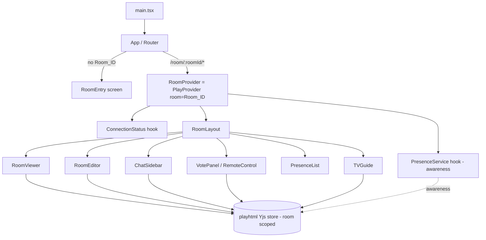
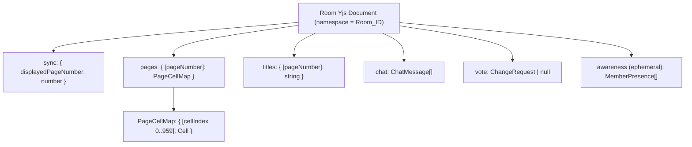

# Design Document

## Overview

This feature re-architects the Teletext Workshop from a single-user application
backed by a serverless `api/` layer (Vercel functions + Redis or a local file
store) into a **real-time collaborative** application backed by
[playhtml](https://github.com/spencerc99/playhtml). Users join named **rooms**
where they co-watch a synchronized teletext page, propose page changes through a
majority **vote**, **chat** in a sidebar, **collaboratively edit** pages with
cell-level conflict resolution, and browse a **TV Guide** of page titles.

The teletext data model is unchanged: a `TeletextPage` is an array of exactly
960 `Cell` objects (40×24). What changes is *where the state lives* and *how many
people share it*. All shared, persistent state moves into playhtml's Yjs-backed
store, scoped per room. The `api/` directory, the `redis` dependency, and the
`lz-string` usage tied to the API are removed.

### Research summary: playhtml / @playhtml/react

Key facts that shape this design (verified against the
[@playhtml/react README](https://github.com/spencerc99/playhtml/blob/main/packages/react/README.md)):

- **`PlayProvider`** initializes the client and connection. It accepts
  `initOptions={{ room, cursors: {...} }}`. The `room` string is the **namespace
  for syncing and storage** — this is exactly our `Room_ID`. It also accepts a
  `pathname` prop that triggers `playhtml.handleNavigation()` on route changes so
  rooms are rebuilt when navigating.
- **`withSharedState({ defaultData, myDefaultAwareness?, id? }, render)`** is a
  higher-order component. The render callback receives
  `{ data, setData, awareness, myAwareness, setMyAwareness, ref }`. `data` is a
  synced, persisted JSON object; `setData(next)` (value or immer-style draft
  mutator) writes it globally. `myAwareness`/`setMyAwareness` are **ephemeral,
  non-persisted** per-client presence values; `awareness` is the array of all
  connected clients' values (including self).
- The store is built on **Yjs (a CRDT)**. Concurrent writes to *different* keys
  of a shared object merge automatically; concurrent writes to the *same* key
  resolve **last-writer-wins (LWW)** and converge deterministically on every
  client. This is the mechanism we rely on for cell-level and title conflict
  resolution.
- **Awareness** is automatically dropped when a client disconnects — this backs
  presence removal and cursor removal without explicit cleanup.
- **Eventing** via `usePlayContext()` / `PlayContext`:
  `registerPlayEventListener`, `removePlayEventListener`, `dispatchPlayEvent`.
- **Cursors/presence** are built in (`cursors: { enabled, room, shouldRenderCursor, container }`)
  and exposed through `usePlayContext().cursors`.

**Design consequence:** because `room` is fixed per `PlayProvider` instance, we
mount a single `PlayProvider` keyed by `Room_ID`. Switching rooms remounts the
provider (a fresh Yjs document). Because same-key concurrent writes are LWW, we
model the page as a **map keyed by cell index** so that edits to *different* cells
never collide, and edits to the *same* cell converge LWW — directly satisfying
Requirement 6.

## Architecture

### High-level component architecture



### Layered responsibilities

The design separates **pure domain logic** (testable, framework-free) from
**playhtml bindings** (thin React hooks/components). This keeps the correctness
properties testable without a live server.

```mermaid
graph LR
  subgraph Pure["Pure domain logic (src/domain) - unit + property tested"]
    RoomId[roomId.ts]
    PageOps[pageOps.ts - normalize / nonEmpty / next-prev]
    Voting[voting.ts - threshold / resolve]
    Titles[titles.ts - validate / trim]
    Chat[chat.ts - validate]
    Guide[guide.ts - entries / order]
    CellEdit[cellEdit.ts - validate / apply]
  end

  subgraph Bindings["playhtml bindings (src/collab) - thin"]
    RoomProvider
    useRoomSync
    useVoting
    useChat
    usePresence
    useEditPage
    useGuide
    useConnection
  end

  Bindings --> Pure
```



### Routing

Routing extends `react-router-dom` v7. The `pathname` from `useLocation()` is
passed to `PlayProvider` so playhtml rebuilds rooms on navigation.

| Route | Screen | Notes |
| --- | --- | --- |
| `/` | `RoomEntry` | Create-room and join-room controls (Req 1.1) |
| `/room/:roomId` | `RoomViewer` inside `RoomProvider` | Co-watching, voting, chat, guide (Req 3–5, 9) |
| `/room/:roomId/edit/:pageNumber` | `RoomEditor` inside `RoomProvider` | Collaborative editing (Req 6) |
| `/` (legacy `/view`, `/edit/:n`) | redirect helpers | Preserve old entry points where feasible |

`Room_ID` in the URL is validated **before** connecting (Req 1.4/1.5). Invalid IDs
render the entry screen with a validation message and never mount `RoomProvider`.

### Why a single PlayProvider per room

`PlayProvider` binds one Yjs document to one `room` namespace. Mounting it with
`key={roomId}` guarantees a clean document per room and a full teardown/rebuild
when the user switches rooms, which matches the requirement that rooms are
isolated collaborative sessions.

## Components and Interfaces

### Providers and shell

**`RoomProvider`** (`src/collab/RoomProvider.tsx`)
Wraps `PlayProvider` with the validated `Room_ID` as `room`, enables cursors, and
supplies the `pathname` for navigation.

```tsx
interface RoomProviderProps {
  roomId: string;           // already validated
  children: React.ReactNode;
}
// Internally:
// <PlayProvider
//   key={roomId}
//   initOptions={{ room: roomId, cursors: { enabled: true, room: roomId, container: cursorLayerRef } }}
//   pathname={pathname}
// >
```

**`RoomEntry`** (`src/components/Room/RoomEntry.tsx`)
Create/join controls. Uses `generateRoomId()` for create and `validateRoomId()`
for join. Preserves the entered value and shows a validation message on invalid
input (Req 1).

### Shared-state hooks (playhtml bindings)

Each hook is a thin wrapper over `withSharedState` (for persisted room data) or
awareness (for ephemeral presence). All decision logic delegates to pure modules.

**`useRoomSync()`** — Req 3
```tsx
interface RoomSync {
  displayedPageNumber: number;                 // default 100 when unset
  page: TeletextPage;                           // normalized, always 960 cells
  setDisplayedPage(n: number): RejectReason | null;   // range-checked 1..999
  gotoNextNonEmpty(): 'ok' | 'none-available';
  gotoPrevNonEmpty(): 'ok' | 'none-available';
}
```

**`useVoting()`** — Req 4
```tsx
interface VotingApi {
  active: ChangeRequest | null;
  submit(target: number): SubmitResult;         // creates request or rejects
  vote(decision: 'accept' | 'reject'): VoteResult;
  tally: { accept: number; reject: number; base: number; threshold: number };
}
```

**`useChat()`** — Req 5
```tsx
interface ChatApi {
  messages: ChatMessage[];                       // chronological asc
  send(text: string): 'ok' | 'empty' | 'too-long';
}
```

**`usePresence()`** — Req 2
```tsx
interface PresenceApi {
  members: MemberIdentity[];                     // from awareness
  me: MemberIdentity;
  count: number;                                 // 0..capacity
  setDisplayName(name: string): 'ok' | 'invalid';
}
```

**`useEditPage(pageNumber)`** — Req 6, 7
```tsx
interface EditPageApi {
  page: TeletextPage;                            // normalized 960 cells
  editCell(index: number, cell: Cell): 'ok' | 'invalid';
  setCursor(index: number | null): void;         // ephemeral, awareness-backed
  remoteCursors: { index: number; color: string; name: string }[];
  saveError: string | null;
}
```

**`useGuide()`** — Req 9
```tsx
interface GuideApi {
  entries: GuideEntry[];                          // filtered + asc by pageNumber
  title(pageNumber: number): string;              // '' when unset
  setTitle(pageNumber: number, text: string): 'ok' | 'too-long';
  selectEntry(pageNumber: number): void;          // routes through useVoting().submit
}
```

**`useConnection()`** — Req 8
```tsx
interface ConnectionApi {
  status: 'connected' | 'disconnected';
  // On reconnect, local edits are re-applied via the same cell-map writes,
  // converging via Yjs LWW.
}
```

### Presentation components

- `RoomLayout` — arranges viewer/editor, chat sidebar, presence list, vote panel,
  guide toggle, connection indicator, and Room_ID copy control (Req 1.6).
- `RoomViewer` / `RoomEditor` — reuse existing `TeletextGrid` and `Editor` UI, but
  read/write through the collab hooks instead of local context.
- `ChatSidebar`, `PresenceList`, `VotePanel`, `TVGuide` — new components.
- Existing `TeletextGrid` is reused unchanged; `Editor` is refactored to accept an
  injected page + `editCell` callback so it can be driven by either local state
  (unchanged single-page use) or the collab hook.

### Pure domain modules (`src/domain`)

| Module | Key functions |
| --- | --- |
| `roomId.ts` | `validateRoomId(id): boolean`, `generateRoomId(existing): string` |
| `pageOps.ts` | `normalizePage(raw): TeletextPage`, `isNonEmptyPage(page): boolean`, `nextNonEmptyPage(cur, pages): number \| null`, `prevNonEmptyPage(cur, pages): number \| null`, `inPageRange(n): boolean` |
| `voting.ts` | `acceptThreshold(base): number`, `resolveChangeRequest(cr, presentMemberIds, now): Resolution` |
| `titles.ts` | `validateTitle(raw): { ok: true; value: string } \| { ok: false }` |
| `chat.ts` | `validateChatMessage(raw): { ok: true; value: string } \| { ok: false; reason }` |
| `cellEdit.ts` | `isValidCell(cell): boolean`, `applyCellEdit(page, index, cell): TeletextPage` |
| `guide.ts` | `guideEntries(pages, titles): GuideEntry[]` (filter + ascending sort) |

## Data Models

### Existing (unchanged)

`Cell`, `TeletextPage` (= `Cell[]` of exactly `TOTAL_CELLS` = 960),
`TeletextColor`, and helpers (`createEmptyPage`, `clonePage`, `indexAt`,
`rowColFromIndex`) from `src/types/teletext.ts` are reused as-is.

### Room-scoped shared state (playhtml / Yjs document)

Each room is one Yjs document (one `Room_ID` namespace). It is composed of several
`withSharedState` entries (each with a stable `id`). Conceptually:



**Page as a cell-indexed map (critical design choice).** Instead of storing a
page as a positional array, each page is stored as a map keyed by cell index
`0..959`:

```ts
type PageCellMap = Record<number, Cell>; // keys "0".."959"
```

Rationale (Req 6.2/6.3, Req 8.5): with a Yjs-backed map, two members editing
**different** cells write **different keys** → both preserved on merge; two
members editing the **same** cell write the **same key** → Yjs resolves
last-writer-wins and every client converges to one identical value. The
positional `TeletextPage` array used by the UI is reconstructed by
`normalizePage()`, which always yields exactly 960 valid cells (missing keys →
empty cell), guaranteeing the size invariant (Req 6.4, 7.7).

**Shared-state entries:**

```ts
// sync (id: "room-sync")
interface RoomSyncData { displayedPageNumber: number } // default { displayedPageNumber: 100 }

// pages (id: "pages"); keyed by pageNumber -> PageCellMap
type PagesData = Record<number, PageCellMap>;

// titles (id: "titles")
type TitlesData = Record<number, string>; // absent key => title length 0

// chat (id: "chat")
interface ChatMessage {
  id: string;            // uuid
  authorId: string;      // stable client id
  authorName: string;    // Identity display name at send time
  authorColor: TeletextColor | string;
  text: string;          // trimmed, 1..500
  ts: number;            // epoch ms
}
type ChatData = { messages: ChatMessage[] };

// vote (id: "vote")
interface Vote { memberId: string; decision: 'accept' | 'reject' }
interface ChangeRequest {
  id: string;
  target: number;              // 1..999
  requesterId: string;
  voteBase: number;            // members present at creation (fixed)
  eligibleMemberIds: string[]; // members present at creation (fixed)
  votes: Record<string, 'accept' | 'reject'>; // memberId -> decision
  createdAt: number;           // epoch ms
  status: 'active' | 'accepted' | 'rejected' | 'expired';
}
type VoteData = { active: ChangeRequest | null };
```

**Ephemeral awareness (per client, not persisted):**

```ts
interface MemberPresence {
  memberId: string;                 // stable per session
  name: string;                     // 1..32 chars
  color: TeletextColor | string;    // from room palette
  editingPageNumber: number | null; // for cursor scoping
  cursorIndex: number | null;       // 0..959 while editing
}
```

### Identity and palette

`ROOM_COLOR_PALETTE` is a fixed list (reusing `TELETEXT_COLORS` non-black subset
plus additional distinct hues). On connect, `usePresence` assigns a default name
(e.g. `Guest-XXXX`) and a palette color, exposed through awareness.

### Persistence keying and migration

- Pages persist in the Playhtml_Store keyed by `Page_Number` over the full range
  `1..999` (Req 7.1). No `/api/pages` calls remain (Req 7.5).
- On load of a page with no stored data, `normalizePage` returns an empty 960-cell
  page (Req 7.4). Any malformed stored page is normalized to a valid 960-cell page
  (Req 7.7).
- **Removal:** delete `api/` (`api/pages/[number].ts`, `api/pages/index.ts`,
  `api/store.ts`, `api/validate.ts`, `api/seed-pages.ts`), remove the `redis`
  dependency and the API-tied `lz-string`/`@vercel/node` usage from `package.json`,
  and drop `/api` rewrites from `vercel.json` (Req 7.6). Seed pages (`.teletext-pages/`)
  become optional one-time import into the store.

## Correctness Properties

*A property is a characteristic or behavior that should hold true across all
valid executions of a system — essentially, a formal statement about what the
system should do. Properties serve as the bridge between human-readable
specifications and machine-verifiable correctness guarantees.*

These properties target the pure domain modules (`src/domain`) plus a small model
of the CRDT merge. Each is universally quantified and implemented as a single
property-based test (minimum 100 iterations).

### Property 1: Room_ID validation is exactly charset + length bounded

*For any* string, `validateRoomId` returns true **iff** the string has length
between 1 and 64 inclusive and contains only letters, digits, and hyphens;
otherwise it returns false.

**Validates: Requirements 1.3, 1.4, 1.5**

### Property 2: Generated Room_IDs are always valid and collision-free

*For any* set of existing Room_IDs, `generateRoomId(existing)` returns a string of
length between 8 and 64 containing only letters, digits, and hyphens, that is not
a member of the existing set (and therefore also passes `validateRoomId`).

**Validates: Requirements 1.2**

### Property 3: Display name validation is exactly length bounded

*For any* string, `validateDisplayName` accepts it **iff** its length is between 1
and 32 inclusive; a rejected name leaves the member's previous name unchanged, and
any assigned default Identity name satisfies this bound.

**Validates: Requirements 2.1, 2.5**

### Property 4: Presence count matches the member list

*For any* awareness set, the displayed member count equals the number of members
in the presence list and lies within the inclusive range 0 to the room's maximum
capacity.

**Validates: Requirements 2.7**

### Property 5: Displayed page changes are range-validated

*For any* integer `n`, `setDisplayedPage(n)` applies the change **iff** `1 <= n <= 999`;
otherwise it retains the current displayed Page_Number and returns a rejection.

**Validates: Requirements 3.5**

### Property 6: Next/previous navigation skips empty pages and wraps

*For any* mapping of Page_Numbers to pages and any current Page_Number,
`nextNonEmptyPage` returns the nearest higher Non_Empty_Page wrapping from 999 to
1, `prevNonEmptyPage` returns the nearest lower Non_Empty_Page wrapping from 1 to
999, and each returns null **iff** no Non_Empty_Page other than the current one
exists.

**Validates: Requirements 3.6, 3.7, 3.8**

### Property 7: Ordered page changes converge to the last applied value

*For any* finite sequence of valid displayed-page-change operations applied in a
fixed order, every replica converges to the most recently applied Page_Number.

**Validates: Requirements 3.9**

### Property 8: Accept threshold is a strict majority

*For any* Vote_Base `b >= 1`, `acceptThreshold(b) = floor(b / 2) + 1` and
`2 * acceptThreshold(b) > b`.

**Validates: Requirements 4.6**

### Property 9: Submitting a change request captures base and requester vote

*For any* room state with no active Change_Request and any valid target
Page_Number, `submit` creates an active Change_Request whose Vote_Base equals the
count of members present at that instant, whose eligible members are exactly those
present members, and which contains exactly one implicit accept Vote attributed to
the requester.

**Validates: Requirements 4.1**

### Property 10: At most one active change request

*For any* room state that already has an active Change_Request, `submit` is
rejected and the existing active Change_Request is retained unchanged.

**Validates: Requirements 4.2**

### Property 11: One vote per eligible member, base fixed, eligibility enforced

*For any* active Change_Request, an eligible member who has not yet voted may
record exactly one accept or reject Vote; a second Vote by that member is rejected
and the original retained; a Vote from a member who was not present at creation is
rejected; a Vote attributed to a member who has left is discarded; and the
Vote_Base remains fixed at its creation value regardless of joins or leaves.

**Validates: Requirements 4.3, 4.4, 4.8**

### Property 12: Vote tally equals recorded votes

*For any* set of recorded Votes on an active Change_Request, the accept and reject
tallies equal the number of accept and reject Votes among eligible members.

**Validates: Requirements 4.5**

### Property 13: Change request resolution is correct and clears the active request

*For any* active Change_Request with any set of Votes, present members, and current
time, `resolveChangeRequest` returns **accepted** (and sets the displayed page to
the target) **iff** accept Votes `>= acceptThreshold(voteBase)`; returns
**rejected** (retaining the current page) when accept Votes plus present members
who have not yet voted is below the threshold; returns **expired** (retaining the
current page) when at least 60 seconds have elapsed since creation with no
accepting or rejecting resolution; and once resolved to any of these states the
active Change_Request is cleared so a new one may be submitted.

**Validates: Requirements 4.6, 4.7, 4.9, 4.10**

### Property 14: Change request target is range-validated

*For any* value, `submit` is rejected and no active Change_Request is created
**iff** the target is not an integer within the inclusive range 1 to 999.

**Validates: Requirements 4.11**

### Property 15: Chat message validation is exactly trimmed-length bounded

*For any* string, `validateChatMessage` accepts it **iff** its trimmed length is
between 1 and 500 inclusive; empty/whitespace-only and over-length messages are
rejected and leave the chat unchanged.

**Validates: Requirements 5.3, 5.5, 5.6**

### Property 16: Sending appends one attributed message in chronological order

*For any* chat and any valid message text, sending appends exactly one
Chat_Message carrying the author Identity and a timestamp, and the resulting
displayed messages are ordered ascending by timestamp.

**Validates: Requirements 5.1, 5.3, 5.7**

### Property 17: Cell edit validation rejects malformed cells as a no-op

*For any* candidate cell, `isValidCell` returns true **iff** its `char`, `fg`, and
`bg` fields are defined and its `graphics` value is either unset or within 0 to
63; applying an invalid edit is a no-op that retains the cell's current value.

**Validates: Requirements 6.7**

### Property 18: A cell edit preserves size and all other cells

*For any* 960-cell page, index `i` in 0..959, and valid cell value, applying the
edit yields a page of exactly 960 cells in which every cell except index `i` is
unchanged and index `i` holds the new value.

**Validates: Requirements 6.1, 6.4, 6.5**

### Property 19: Concurrent edits converge deterministically (cell-level CRDT)

*For any* page and any two concurrent edits, edits to different cells both persist,
edits to the same cell converge to the value of the edit applied last, and every
replica converges to one identical 960-cell page regardless of the order edits are
received.

**Validates: Requirements 6.2, 6.3, 8.5, 9.12**

### Property 20: Page normalization always yields 960 valid cells and is identity on valid pages

*For any* input value, `normalizePage` returns a page of exactly 960 cells each
with defined `char`, `fg`, and `bg` (missing or malformed cells become empty
cells); and *for any* already-valid 960-cell page, `normalizePage` returns an
equal page.

**Validates: Requirements 7.4, 7.7**

### Property 21: Title validation trims and is length bounded with empty default

*For any* string, `validateTitle` accepts it **iff** its trimmed length is between
0 and 60 inclusive, returning the trimmed value (a whitespace-only or empty input
yields a title of length 0); a trimmed length above 60 is rejected and retains the
current title; and a Page_Number with no stored title reads as a title of length 0.

**Validates: Requirements 9.2, 9.4, 9.6**

### Property 22: Guide listing has exactly the qualifying entries in ascending order

*For any* mapping of pages and titles, `guideEntries` contains exactly the
Page_Numbers that are a Non_Empty_Page or have a Page_Title of length 1 or greater,
each paired with its current Page_Title, ordered strictly ascending by Page_Number
(and is empty when no Page_Number qualifies).

**Validates: Requirements 9.7, 9.11, 9.13**

## Error Handling

| Scenario | Requirement | Handling |
| --- | --- | --- |
| Invalid Room_ID (submit or URL) | 1.5, 1.4 | Do not mount `RoomProvider`; stay on entry screen, preserve entered value, show validation message. |
| Invalid display name | 2.5 | Reject via `validateDisplayName`; keep previous name; surface inline error. |
| Displayed page out of range | 3.5 | `setDisplayedPage` returns rejection; current page retained; toast/indication. |
| No other non-empty page for next/prev | 3.8 | `nextNonEmptyPage`/`prevNonEmptyPage` return null; retain page; show "no other page" indication. |
| Second concurrent change request | 4.2 | `submit` rejected; existing request retained; disable submit while active. |
| Duplicate / ineligible vote | 4.4, 4.8 | Vote rejected; original retained; ineligible (late-joiner) votes ignored. |
| Out-of-range vote target | 4.11 | No request created; validation message. |
| Change request timeout | 4.9 | Any client computes expiry from `createdAt + 60000`; writes `status = expired` (idempotent, converges via LWW); active cleared. |
| Empty/oversized chat message | 5.5, 5.6 | Reject via `validateChatMessage`; chat unchanged; inline error. |
| Invalid cell edit | 6.7 | `isValidCell` false → `applyCellEdit` no-op; retain cell; validation indication. |
| Malformed stored page | 7.7 | `normalizePage` substitutes empty 960-cell page. |
| Persist failure | 7.9 | Keep the member's in-editor edits; show "change not saved" indication; retry on next change/reconnect. |
| Connection lost | 8.1, 8.3, 8.4 | Show disconnected indicator; retain last page; allow local editing buffered by Yjs. |
| Reconnect | 8.2, 8.5 | Re-sync to shared page; re-apply buffered edits; conflicts resolve cell-level LWW; clear indicator. |
| Oversized title | 9.6 | Reject via `validateTitle`; retain current title; error indication. |

**Deterministic timeout resolution.** To avoid divergent resolutions, expiry and
threshold resolution are computed as pure functions of the stored Change_Request
(`createdAt`, `voteBase`, `votes`) and are idempotent: writing the resolved status
multiple times from multiple clients converges to a single value via Yjs LWW. A
lightweight "first observer writes" pattern (guarded by `status === 'active'`)
minimizes redundant writes.

## Testing Strategy

### Dual approach

- **Property-based tests** verify the 22 universal properties above against the
  pure `src/domain` modules and a CRDT merge model. Use
  [fast-check](https://github.com/dubzzz/fast-check) (the standard PBT library for
  the TypeScript/Vitest ecosystem) — do not hand-roll generators-as-framework.
- **Unit / example tests** cover concrete UI states and wiring: entry-screen
  controls (1.1), clipboard copy (1.6), presence rendering and empty state (2.3,
  2.8), default page 100 (3.4), empty-chat indication (5.2), editor title field
  (9.3), "No title" rendering (9.8), guide-open no-op on displayed page (9.9), and
  guide selection routing through voting rather than direct set (9.10).
- **Integration tests** (two simulated clients over a playhtml/Yjs test harness)
  cover sync-timing and awareness behaviors that are not input-varying logic:
  presence add/update/remove (2.2, 2.4, 2.6), page/message/title propagation (3.2,
  3.3, 5.4, 7.3, 7.8, 9.5), cursor propagation/removal (6.6, 6.8), and
  connection/reconnect behavior (8.1–8.4).
- **Smoke / static checks** verify the migration: no `fetch('/api/pages')` remains
  in the client (7.5), the `api/` directory is removed, and `redis` is absent from
  `package.json` (7.6).

### Test runner and tooling

- Add **Vitest** as the test runner (Vite-native) and **fast-check** for PBT, run
  via Bun (`bun run test`, single-run mode — no watch in CI).
- Each property test runs a **minimum of 100 iterations**.
- Each property test is tagged with a comment referencing its design property:
  `// Feature: collaborative-teletext-rooms, Property {number}: {property_text}`.
- Implement each of the 22 correctness properties with exactly **one**
  property-based test.

### CRDT model testing

Property 19 (and by consolidation 6.2/6.3/8.5/9.12) is tested with a **model-based**
approach: a small in-memory reducer models the cell-indexed map merge (per-key
last-writer-wins keyed by a Lamport-style timestamp/client tie-break) mirroring
Yjs `Y.Map` semantics. The property applies arbitrary interleavings of concurrent
edits to two replicas and asserts identical convergence and preservation of
distinct-cell edits. A separate integration test validates the same behavior
against real playhtml/Yjs to confirm the model matches the library.

### Migration verification

- Remove `api/` and update `vercel.json` to drop `/api` rewrites; verify the app
  builds (`bun run build`) and loads pages exclusively from the Playhtml_Store.
- Remove `redis`, `@vercel/node`, and API-tied `lz-string`/`@types/lz-string` from
  `package.json`; verify install and typecheck succeed.
- Optionally migrate seed content in `.teletext-pages/` into the store as a
  one-time import so existing pages 100/200 remain available.
